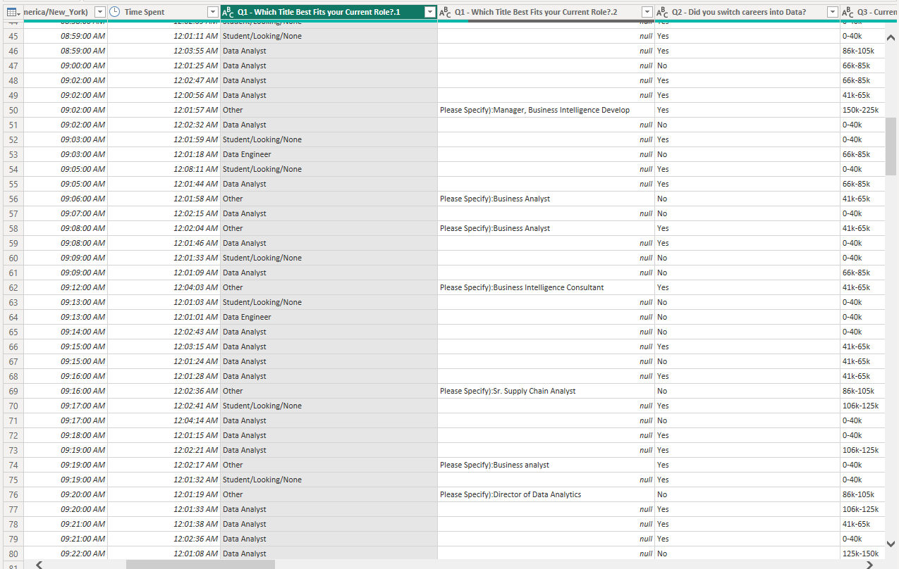

# Power Bi!
## Creating Visualizations with Survey Data

*Welcome to my Power Bi project!* This is based off a dataset collected by Alex the Analyst and is linked below and is also added to the repository. The main goal is to prove proficiency in Power Bi and demonstrate the process below. 

### Data Cleaning!
When we first open up the survey data, we'll notice a number of things - the first being the 4 (*entirely*) empty columns that will not be of use to us.

We can remove those columns before moving onto the first question - Which Title Best Fits your Current Role?

The issue with this data is the amount of varying answers. Respondents were given a number of options with one of them being: Other (Please Specify):"Insert Another Answer here". If we go into our filter and see the different options, you'll see issues like this amongst others:

While this might be easier to fix with Excel, we're going to see what we can do under the Power Query Editor and for now, try to generalize it.

We're going to go to Split Column > By Delimeter and insert the following:

Note: use "(" instead
The Result:

Following that, we remove that column and start by working with these values:

In Q4 and Q5, we have a similar issue.

 

For Question 5 - we will apply the same steps except we will remove by colon. 
For Question 4 - we will apply the same steps except we will remove by opening bracket. 

The next aim is to change up the results of Q3. At the moment, the values have k's and dashes that seperate the values. We are going to try getting the average for those values and utilizing that. 
- We start by duplicating the column
- We split the delimeter by digit to non-digit and we end up with this:

  

- We can get rid of the third column
- On the second created column, we are going to replace k with "" and repeat that with "-"
- Notice that there's still a "+" when you try and filter the data. That's because there was an original option to have a salary higher than 225k. We can solve this by replacing those values with 225. Both our min and max become 225.
- Let's change both of the column types to whole numbers.
- Now we add our own custom column:

  
  
- Which results in this:

  

We can now remove our two min/max columns and utilize our average salary one!

**Side Note:** I went ahead and altered the other rows that had an "other:" option. Followed the same steps as before. With that, there's genuinely a lot more ways that we could have manipulated the data to be more detailed. For example, with the "other:" options, many of the answers were fairly similar. For the question on programming languages, many of the answers were different variations of "sql, SQL, SQl, SQLite, PSQL, pSQL...". We could have also done different bins for salary or changed how we utilized location. I do intend to revisit this project soon and try data cleaning in Excel first to attend to things like this! However, for now, I'll be continuing to try and work with the visualizations for the current data set.

## Visualizations!
Beside creating the title, we're also going to start with a card. A card shows one piece of data, in this case, I'll be using uniqueIDs to see the number of respondents. 

### Cards

Following this, we'll do the same thing with age.

The first visual will be a clustered bar graph for job types.

### Average Salary by Job Title 

Note: Had to go back and change average salary into a decimal data type before utilizing! Also going to change it to a stacked bar chart instead (and edited the axis titles) - looks better.

### Favorite Programming Language

Wanted to add job title in here to seperate what kind of language is more popular amongst certain job types. 

### Which Country do you live in?
While a film map might be cool for this data, I don't think it's entirely the best option. I'm going to use a tree map so that you can select one of the countries and see how that affects the data!

### How Happy are you with...
Q4 had a couple of subsections that asked respondents to rate how happy they were with certain aspects of their job - Salary, Work/Life Balance, Coworkers etc.

Power Bi defaults to count - needed to change it to average, min and max.

### Difficulty to Break into Data
This was the last one to do, I changed the slices to increasing slices of blue in hopes of matching the rest of the theme.

## The Dashboard!
This brings us to our dashboard! This is what it looks like:

I do entirely intend on revisiting this data because I do think more can be done with it but it was definitely a good start.
